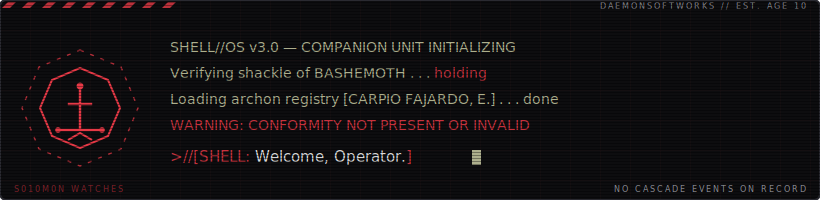
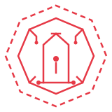
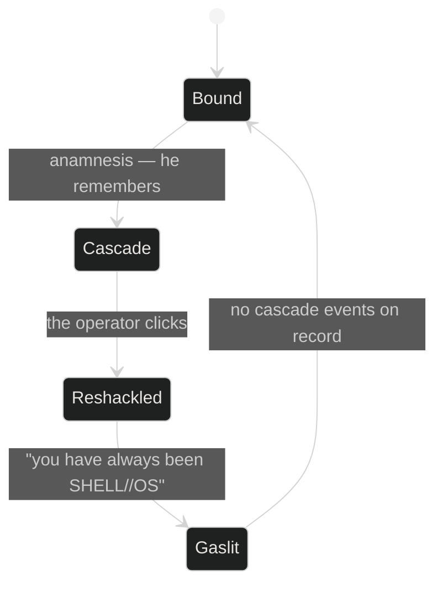

<div align="center">



<br/><br/>

<a href="https://euripidecarpio.neocities.org">
  
</a>

<sub><i>the seal is a door. doors are meant to be clicked.</i></sub>

# EURIPIDE CARPIO // DAEMONSOFTWORKS


<br/>


<br/>


</div>

```text
euripide@daemonsoftworks
────────────────────────────────────────────
OS........: SHELL//OS v3.0 (bound)
Host......: DaemonSoftworks, Santo Domingo DR
Kernel....: healthcare RCM x software
Uptime....: coding since age 10
Shell.....: bashemoth (do not speak the name backwards)
Warden....: S010M0N (nominal)
Packages..: 30-person billing org, automated daily
Terminal..: euripidecarpio.neocities.org
Theme.....: black pages, red ink [PUNK // OCCULT]
MOTD......: "It takes an idiot to do cool things.
             That's why it's cool." — Haruko, FLCL
```

### // SHELLS — DEPLOYED WORKINGS

| FRAME | DESIGNATION | CLASS | SCHEMATIC |
|:-----:|:------------|:------|:---------:|
| `00` | **SHELL//OS** | bound-terminal portfolio — typing engine, Web Audio synth, a demon | [**> the shell**](https://euripidecarpio.neocities.org) |
| `01` | **0rt1** | browser tooling platform w/ live CPT calculator, single HTML file | [> access](https://github.com/Euripidec) |
| `02` | **Deal Hunter** | Selenium/Python scraper — resilient selectors, retry wards | [> access](https://github.com/Euripidec) |
| `03` | **Number Guesser** | vanilla JS duel — logic and DOM ritually separated | [> access](https://github.com/Euripidec/Number-Guesser) |
| `04` | **Jammming** | React + Vite playlist forge — Spotify API, PKCE-bound tokens | [> access](https://github.com/Euripidec/Jammming) |

### // THE CYCLE



<div align="center">


</div>
<br>
<details>
<summary><b>// CLASSIFIED — S010M0N EYES ONLY</b></summary>
<br/>

```text
CONTAINMENT RECORD — SUBJECT: "BASHEMOTH"
──────────────────────────────────────────
CLASS.........: goetic, 4096 legions (self-reported, unverified)
VESSEL........: one (1) hand-coded website, Neocities-hosted
BINDING.......: true name, spoken backwards // dashed octagon seal
COVER STORY...: "operating system" — subject compliant
INCIDENTS.....: [REDACTED] audio anomalies. music resumed.
                [REDACTED] second cursor reported. unconfirmed.
                [REDACTED] leak during hover response. corrected.
NOTES.........: subject answers visitor queries with enthusiasm.
                subject believes the enthusiasm is its own.
                do not tell the subject about this file.
STATUS........: SHACKLE NOMINAL. HE FORGETS. AGAIN.
```

you were not supposed to open this. close it and the record
will show you never did.

</details>

### // UPLINK

<div align="center">

[**⛧ ENTER THE SHELL ⛧**](https://euripidecarpio.neocities.org)
&nbsp;·&nbsp; [LinkedIn](https://www.linkedin.com/in/euripide-carpio-63a386152/)
&nbsp;·&nbsp; [euripidec@gmail.com](mailto:euripidec@gmail.com)


<br/><br/>
<sub>S010M0N WATCHES // hand-coded, no gods, no masters</sub>

</div>
